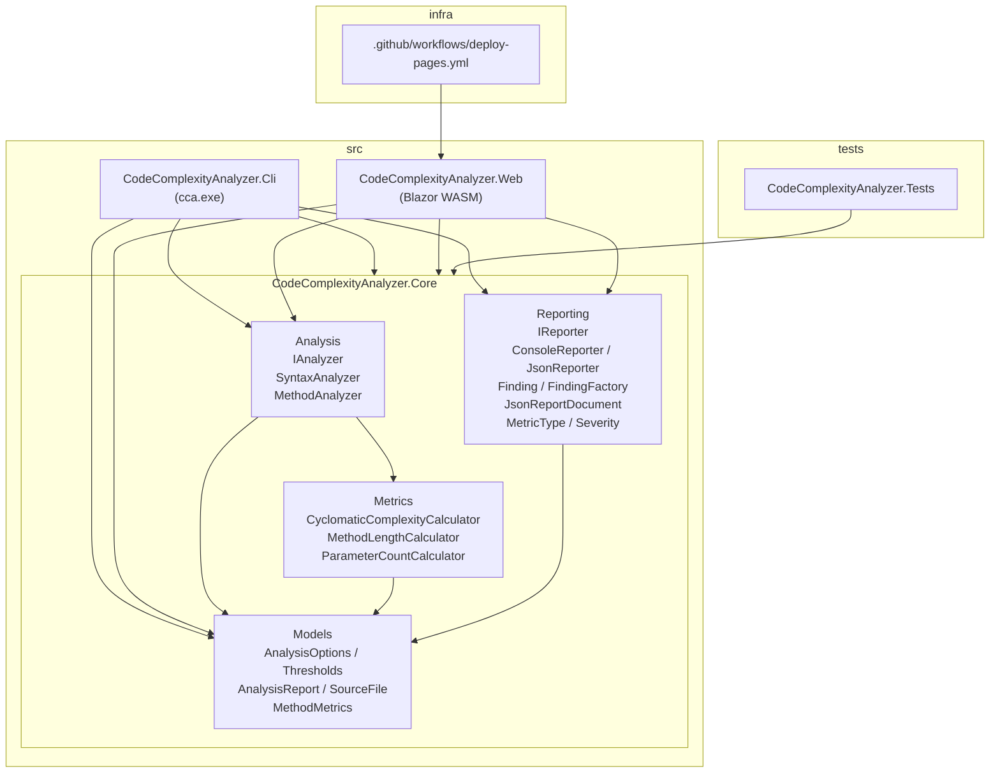

# Codebase Map

> Auto-generated by Cartographer. Last mapped: 2026-05-09T09:50:30Z

## System Overview

**CodeComplexityAnalyzer** (`cca`) is a Roslyn-based static analysis tool for C#. It parses raw `.cs` files with the syntax-only API (no MSBuild project load, no semantic model), enumerates every `MethodDeclarationSyntax`, computes three metrics per method (cyclomatic complexity, line count, parameter count), filters hotspots that exceed thresholds, and renders the report as either an aligned console table or structured JSON. Exit codes: `0` (clean), `1` (hotspots found), `2` (path not found). A Blazor WebAssembly frontend at https://abubakr0904.github.io/CodeComplexityAnalyzer/ exposes the same Core analysis engine in-browser, supporting both paste-code mode and live GitHub repo analysis.

**Stack**: .NET 10 (`net10.0`, SDK `10.0.101`), C# `latest`, Roslyn (`Microsoft.CodeAnalysis.CSharp` 4.14.0), `System.CommandLine` 2.0.0-beta4, Blazor WebAssembly (`Microsoft.AspNetCore.Components.WebAssembly`), xUnit 2.9.3. Nullable reference types, implicit usings, `TreatWarningsAsErrors`, and Central Package Management are enabled solution-wide.



## Directory Structure

```
CodeComplexityAnalyzer/
├── .coderabbit.yaml                    CodeRabbit review config
├── CodeComplexityAnalyzer.sln          VS solution; src/ + tests/ folders
├── Directory.Build.props               net10.0, nullable, warnings-as-errors
├── Directory.Packages.props            Central Package Management (CPM)
├── global.json                         pins SDK 10.0.101
├── README.md                           usage + metrics table + exit codes + live demo link
├── .github/
│   └── workflows/
│       └── deploy-pages.yml            Builds Blazor WASM, rewrites base href, deploys to GitHub Pages
├── docs/
│   └── superpowers/
│       └── plans/
│           └── 2026-05-09-json-output-format.md
├── samples/
│   └── UglyCode.cs                     fixture with deliberate hotspots
├── src/
│   ├── CodeComplexityAnalyzer.Cli/     entry point; AssemblyName=cca
│   │   ├── CodeComplexityAnalyzer.Cli.csproj
│   │   ├── FileSourceCollector.cs      file enumeration + reading (all File I/O lives here)
│   │   └── Program.cs                  System.CommandLine wiring; uses FileSourceCollector
│   ├── CodeComplexityAnalyzer.Core/    analysis engine (pure; no file I/O)
│   │   ├── CodeComplexityAnalyzer.Core.csproj
│   │   ├── Analysis/
│   │   │   ├── IAnalyzer.cs            interface: AnalyzeSource / AnalyzeSources
│   │   │   ├── SyntaxAnalyzer.cs       implements IAnalyzer; pure parsing, no I/O
│   │   │   └── MethodAnalyzer.cs       static; runs all 3 calculators
│   │   ├── Metrics/
│   │   │   ├── CyclomaticComplexityCalculator.cs   CSharpSyntaxWalker
│   │   │   ├── MethodLengthCalculator.cs           line-span based
│   │   │   └── ParameterCountCalculator.cs         one-liner
│   │   ├── Models/
│   │   │   ├── AnalysisOptions.cs      Thresholds + AnalysisOptions records
│   │   │   ├── AnalysisReport.cs       top-level result record
│   │   │   ├── MethodMetrics.cs        per-method record
│   │   │   └── SourceFile.cs           carries FilePath + SourceCode (I/O boundary)
│   │   └── Reporting/
│   │       ├── IReporter.cs            single Render(...) method
│   │       ├── ConsoleReporter.cs      fixed-width plain-text table
│   │       ├── JsonReporter.cs         structured JSON with per-violation findings
│   │       ├── Finding.cs              per-violation record (file, line, method, metric, severity)
│   │       ├── FindingFactory.cs       builds Findings from MethodMetrics + Thresholds
│   │       ├── JsonReportDocument.cs   top-level JSON DTO
│   │       ├── MetricType.cs           enum: CyclomaticComplexity / LineCount / ParameterCount
│   │       └── Severity.cs             enum: Warning / Error
│   └── CodeComplexityAnalyzer.Web/     Blazor WASM frontend
│       ├── CodeComplexityAnalyzer.Web.csproj
│       ├── Program.cs                  WASM host; registers HttpClient
│       ├── App.razor                   router + layout wiring
│       ├── MainLayout.razor            shell layout
│       ├── _Imports.razor              global using directives for Razor files
│       ├── Pages/
│       │   └── Index.razor             paste mode + GitHub repo URL mode
│       ├── Properties/
│       │   └── launchSettings.json     dev server ports
│       └── wwwroot/
│           ├── index.html              SPA entry point (base href rewritten at deploy)
│           └── css/
│               └── app.css             default Blazor WASM stylesheet
└── tests/
    └── CodeComplexityAnalyzer.Tests/
        ├── CodeComplexityAnalyzer.Tests.csproj   xUnit, references Core only
        ├── CyclomaticComplexityCalculatorTests.cs   6 unit [Fact]s
        ├── FindingFactoryTests.cs                   6 unit [Fact]s for Finding creation + severity
        ├── JsonReporterTests.cs                     5 [Fact]s; validates JSON schema + camelCase
        └── SyntaxAnalyzerTests.cs                   3 [Fact]s; in-memory string inputs (no temp files)
```

## Module Guide

### CLI (`src/CodeComplexityAnalyzer.Cli`)

**Purpose**: Console entry point. All file I/O lives here. Parses args, collects sources via `FileSourceCollector`, invokes `SyntaxAnalyzer.AnalyzeSources`, selects an `IReporter`, and sets `Environment.ExitCode`.
**Entry point**: [Program.cs](src/CodeComplexityAnalyzer.Cli/Program.cs)

| File | Purpose | Tokens |
|------|---------|--------|
| [CodeComplexityAnalyzer.Cli.csproj](src/CodeComplexityAnalyzer.Cli/CodeComplexityAnalyzer.Cli.csproj) | Exe; `AssemblyName=cca`; refs `System.CommandLine` and Core | 110 |
| [FileSourceCollector.cs](src/CodeComplexityAnalyzer.Cli/FileSourceCollector.cs) | `internal static class`; `Collect(rootPath, excludeDirectories) → IEnumerable<SourceFile>`; handles single-file and directory cases; segment-based exclusion | ~150 |
| [Program.cs](src/CodeComplexityAnalyzer.Cli/Program.cs) | Top-level statements; `RootCommand` with positional `path` and `--format`/`--max-cc`/`--max-lines`/`--max-params`; calls `FileSourceCollector.Collect` then `SyntaxAnalyzer.AnalyzeSources` | 489 |

**Exports**: none (Exe).
**Dependencies**: `System.CommandLine`, `CodeComplexityAnalyzer.Core`.
**Dependents**: none.

### Core / Analysis (`src/CodeComplexityAnalyzer.Core/Analysis`)

**Purpose**: Orchestrates the full pipeline: Roslyn parsing, per-method metric computation, hotspot filtering. No file I/O — callers supply source code strings.

| File | Purpose | Tokens |
|------|---------|--------|
| [IAnalyzer.cs](src/CodeComplexityAnalyzer.Core/Analysis/IAnalyzer.cs) | `public interface`; `AnalyzeSource(sourceCode, filePath) → IReadOnlyList<MethodMetrics>`; `AnalyzeSources(sources, rootPath, thresholds) → AnalysisReport` | 89 |
| [SyntaxAnalyzer.cs](src/CodeComplexityAnalyzer.Core/Analysis/SyntaxAnalyzer.cs) | `sealed class : IAnalyzer`; `AnalyzeSource` parses one string; `AnalyzeSources` iterates `SourceFile` list, filters hotspots, sorts by CC desc | 326 |
| [MethodAnalyzer.cs](src/CodeComplexityAnalyzer.Core/Analysis/MethodAnalyzer.cs) | `public static class`; `Analyze(MethodDeclarationSyntax, string filePath) → MethodMetrics`; `FindContainingType` walks parents, falls back to `"<global>"` | 226 |

**Exports**: `IAnalyzer`, `SyntaxAnalyzer`, `MethodAnalyzer`.
**Dependencies**: `Microsoft.CodeAnalysis.CSharp`, `Metrics`, `Models`.
**Dependents**: CLI (`FileSourceCollector` + `Program.cs`), Web (`Index.razor`).

### Core / Metrics (`src/CodeComplexityAnalyzer.Core/Metrics`)

**Purpose**: Pure functions. Each calculator is a `public static class` with a single `Calculate(MethodDeclarationSyntax) → int` method.

| File | Purpose | Tokens |
|------|---------|--------|
| [CyclomaticComplexityCalculator.cs](src/CodeComplexityAnalyzer.Core/Metrics/CyclomaticComplexityCalculator.cs) | Uses inner `ComplexityWalker : CSharpSyntaxWalker`; counts `if/while/do/for/foreach/case (incl. pattern)/switch arm/catch/?:/&&/\|\|/??` (base 1) | 462 |
| [MethodLengthCalculator.cs](src/CodeComplexityAnalyzer.Core/Metrics/MethodLengthCalculator.cs) | Inclusive line-span of `method.Body` or `method.ExpressionBody`; `0` for abstract/interface methods | 131 |
| [ParameterCountCalculator.cs](src/CodeComplexityAnalyzer.Core/Metrics/ParameterCountCalculator.cs) | `method.ParameterList.Parameters.Count` | 43 |

**Exports**: three static calculators.
**Dependencies**: `Microsoft.CodeAnalysis.CSharp`.
**Dependents**: `Analysis/MethodAnalyzer`.

### Core / Models (`src/CodeComplexityAnalyzer.Core/Models`)

**Purpose**: Immutable `sealed record` types for inputs and results.

| File | Purpose | Tokens |
|------|---------|--------|
| [AnalysisOptions.cs](src/CodeComplexityAnalyzer.Core/Models/AnalysisOptions.cs) | `Thresholds` (CC=10, Lines=60, Params=5 defaults); `AnalysisOptions` with `RootPath`, `Thresholds`, `IReadOnlyList<string> ExcludeDirectories`; static `ForPath(string)` factory | 113 |
| [AnalysisReport.cs](src/CodeComplexityAnalyzer.Core/Models/AnalysisReport.cs) | `RootPath`, `FilesAnalyzed`, `MethodsAnalyzed`, `Methods` (all), `Hotspots` (violations) | 50 |
| [MethodMetrics.cs](src/CodeComplexityAnalyzer.Core/Models/MethodMetrics.cs) | `MethodName`, `ContainingType`, `FilePath`, `LineNumber` (1-based), `CyclomaticComplexity`, `LineCount`, `ParameterCount` | 51 |
| [SourceFile.cs](src/CodeComplexityAnalyzer.Core/Models/SourceFile.cs) | `sealed record SourceFile(string FilePath, string SourceCode)`; the I/O boundary type passed from callers to Core | ~10 |

**Exports**: four records.
**Dependencies**: BCL only.
**Dependents**: `Analysis`, `Reporting`, CLI, Web.

### Core / Reporting (`src/CodeComplexityAnalyzer.Core/Reporting`)

**Purpose**: Output abstraction. One interface, two implementations, and the finding model used by the JSON output.

| File | Purpose | Tokens |
|------|---------|--------|
| [IReporter.cs](src/CodeComplexityAnalyzer.Core/Reporting/IReporter.cs) | Single method: `void Render(AnalysisReport report, TextWriter writer)` | 35 |
| [ConsoleReporter.cs](src/CodeComplexityAnalyzer.Core/Reporting/ConsoleReporter.cs) | Summary header + fixed-width hotspot table (CC=5, Lines=6, Params=7); plain text (no ANSI) | 229 |
| [JsonReporter.cs](src/CodeComplexityAnalyzer.Core/Reporting/JsonReporter.cs) | Takes `Thresholds` via ctor; iterates `report.Hotspots`, expands to per-violation `Finding`s via `FindingFactory`, serializes `JsonReportDocument` with camelCase properties and string-enum conversion | 238 |
| [Finding.cs](src/CodeComplexityAnalyzer.Core/Reporting/Finding.cs) | `sealed record`; carries `FilePath`, `LineNumber`, `MethodName`, `ContainingType`, `MetricType`, `Value`, `Threshold`, `Severity` | 51 |
| [FindingFactory.cs](src/CodeComplexityAnalyzer.Core/Reporting/FindingFactory.cs) | `public static class`; `Create(MethodMetrics, Thresholds) → IEnumerable<Finding>`; yields up to three findings per method (one per violated metric); computes `Severity` via integer-math rule: `value*2 >= threshold*3` → `Error`, else `Warning` | 275 |
| [JsonReportDocument.cs](src/CodeComplexityAnalyzer.Core/Reporting/JsonReportDocument.cs) | `sealed record`; top-level JSON DTO: `SchemaVersion`, `RootPath`, `FilesAnalyzed`, `MethodsAnalyzed`, `Findings` | 46 |
| [MetricType.cs](src/CodeComplexityAnalyzer.Core/Reporting/MetricType.cs) | `enum`: `CyclomaticComplexity`, `LineCount`, `ParameterCount` | 29 |
| [Severity.cs](src/CodeComplexityAnalyzer.Core/Reporting/Severity.cs) | `enum`: `Warning`, `Error` | 20 |

**Exports**: `IReporter`, `ConsoleReporter`, `JsonReporter`, `Finding`, `FindingFactory`, `JsonReportDocument`, `MetricType`, `Severity`.
**Dependencies**: `Models`, BCL (`System.Text.Json`).
**Dependents**: CLI, Web.

### Web (`src/CodeComplexityAnalyzer.Web`)

**Purpose**: Blazor WebAssembly standalone frontend. References Core directly (runs in-browser via WASM). Two analysis modes: paste C# source into a textarea, or supply a GitHub repo URL and fetch files via the GitHub REST API. No server-side component.

**Live site**: https://abubakr0904.github.io/CodeComplexityAnalyzer/

| File | Purpose | Tokens |
|------|---------|--------|
| [CodeComplexityAnalyzer.Web.csproj](src/CodeComplexityAnalyzer.Web/CodeComplexityAnalyzer.Web.csproj) | `Sdk="Microsoft.NET.Sdk.BlazorWebAssembly"`; refs `Microsoft.AspNetCore.Components.WebAssembly` + `DevServer`; project ref to Core | 148 |
| [Program.cs](src/CodeComplexityAnalyzer.Web/Program.cs) | WASM host bootstrap; registers scoped `HttpClient` with `HostEnvironment.BaseAddress` | 80 |
| [App.razor](src/CodeComplexityAnalyzer.Web/App.razor) | `<Router>`; wires `MainLayout`; 404 fallback message | 113 |
| [MainLayout.razor](src/CodeComplexityAnalyzer.Web/MainLayout.razor) | Minimal shell layout wrapping `@Body` | 16 |
| [_Imports.razor](src/CodeComplexityAnalyzer.Web/_Imports.razor) | Global `@using` directives for all Razor files | 53 |
| [Pages/Index.razor](src/CodeComplexityAnalyzer.Web/Pages/Index.razor) | Main page (2650 tokens). Paste mode: `<textarea>` → `SyntaxAnalyzer.AnalyzeSource` → `FindingFactory.Create` → render table. GitHub mode: parses `github.com/owner/repo` URL, calls GitHub API for repo info + recursive tree, downloads each `.cs` blob from `raw.githubusercontent.com`, feeds to `AnalyzeSource`; handles PAT auth, rate-limit errors (`X-RateLimit-Remaining`/`X-RateLimit-Reset` headers), tree truncation, 404, and malformed JSON | 2650 |
| [Properties/launchSettings.json](src/CodeComplexityAnalyzer.Web/Properties/launchSettings.json) | Dev server http/https ports | 311 |
| [wwwroot/index.html](src/CodeComplexityAnalyzer.Web/wwwroot/index.html) | SPA entry; `<base href="/" />` (rewritten to `/CodeComplexityAnalyzer/` by CI at deploy) | 172 |
| [wwwroot/css/app.css](src/CodeComplexityAnalyzer.Web/wwwroot/css/app.css) | Default Blazor WASM template stylesheet | 1430 |

**Exports**: none (WASM app).
**Dependencies**: `Microsoft.AspNetCore.Components.WebAssembly`, `CodeComplexityAnalyzer.Core`.
**Dependents**: none.

### Tests (`tests/CodeComplexityAnalyzer.Tests`)

**Purpose**: xUnit tests. References Core only — CLI and Web are not exercised.

| File | Purpose | Tokens |
|------|---------|--------|
| [CyclomaticComplexityCalculatorTests.cs](tests/CodeComplexityAnalyzer.Tests/CyclomaticComplexityCalculatorTests.cs) | 6 `[Fact]`s; `ParseMethod(source)` helper wraps code in `class C { ... }` | 483 |
| [FindingFactoryTests.cs](tests/CodeComplexityAnalyzer.Tests/FindingFactoryTests.cs) | 6 `[Fact]`s; covers no-violation, single-metric violation, all-three-metrics, severity boundary (exact `value*2 >= threshold*3`), and method identity propagation | 713 |
| [JsonReporterTests.cs](tests/CodeComplexityAnalyzer.Tests/JsonReporterTests.cs) | 5 `[Fact]`s; validates JSON schema (`schemaVersion`, `rootPath`, etc.), camelCase property names, string enum values (`"cyclomaticComplexity"`, `"error"`), multi-finding expansion, and that non-hotspots produce no findings | 1014 |
| [SyntaxAnalyzerTests.cs](tests/CodeComplexityAnalyzer.Tests/SyntaxAnalyzerTests.cs) | 3 `[Fact]`s; all in-memory string inputs via `AnalyzeSource`/`AnalyzeSources` — no temp files, no `IDisposable` teardown | 462 |

### Samples

| File | Purpose | Tokens |
|------|---------|--------|
| [samples/UglyCode.cs](samples/UglyCode.cs) | `OrderProcessor` fixture: `Classify` (5 params, deep branching), `Sum` (clean), `DoEverything` (high CC + lines) | 434 |

## Data Flow

### CLI flow

```mermaid
sequenceDiagram
    participant User
    participant Program as Program.cs
    participant FSC as FileSourceCollector
    participant SA as SyntaxAnalyzer
    participant MA as MethodAnalyzer
    participant CC as CyclomaticComplexityCalculator
    participant ML as MethodLengthCalculator
    participant PC as ParameterCountCalculator
    participant Rep as IReporter

    User->>Program: cca <path> [--format --max-cc --max-lines --max-params]
    Program->>Program: System.CommandLine parses args
    Program->>Program: validate path exists (exit 2 if not)
    Program->>Program: build AnalysisOptions + Thresholds
    Program->>FSC: Collect(rootPath, excludeDirectories)
    FSC->>FSC: single file → one SourceFile; directory → enumerate *.cs, skip excluded segments
    FSC-->>Program: IEnumerable<SourceFile>
    Program->>SA: AnalyzeSources(sources, rootPath, thresholds)
    loop per SourceFile
        SA->>SA: CSharpSyntaxTree.ParseText(sourceCode, filePath)
        SA->>SA: DescendantNodes().OfType<MethodDeclarationSyntax>()
        loop per MethodDeclarationSyntax
            SA->>MA: Analyze(method, filePath)
            MA->>CC: Calculate(method) → int
            MA->>ML: Calculate(method) → int
            MA->>PC: Calculate(method) → int
            MA-->>SA: MethodMetrics
        end
    end
    SA->>SA: filter IsHotspot, OrderByDescending(CC)
    SA-->>Program: AnalysisReport
    Program->>Program: pick IReporter by --format
    Program->>Rep: Render(report, Console.Out)
    Rep-->>User: console table or JSON
    Program->>Program: ExitCode = 1 if hotspots.Count > 0
```

### Web / GitHub repo flow

```mermaid
sequenceDiagram
    participant User
    participant Browser as Index.razor (WASM)
    participant GHAPI as api.github.com
    participant Raw as raw.githubusercontent.com
    participant SA as SyntaxAnalyzer (in-browser)
    participant FF as FindingFactory

    User->>Browser: enter GitHub URL + optional PAT, click "Analyze repo"
    Browser->>Browser: TryParseRepoUrl → owner, repo
    Browser->>GHAPI: GET /repos/{owner}/{repo} (repo info)
    GHAPI-->>Browser: { default_branch }
    Browser->>GHAPI: GET /repos/{owner}/{repo}/git/trees/{branch}?recursive=1
    GHAPI-->>Browser: { tree[], truncated }
    Browser->>Browser: filter blobs ending .cs; skip bin/obj/node_modules segments
    loop per .cs file (progress shown every 5 files)
        Browser->>Raw: GET /{owner}/{repo}/{branch}/{path}
        Raw-->>Browser: source text (skip on 404/error)
        Browser->>SA: AnalyzeSource(sourceText, path)
        SA-->>Browser: IReadOnlyList<MethodMetrics>
        Browser->>FF: Create(metrics, thresholds)
        FF-->>Browser: IEnumerable<Finding>
    end
    Browser->>Browser: render findings table (Severity / Metric / File / Method / Type / Line / Value / Threshold)
    Browser-->>User: table or "no findings" message
```

## Conventions

- **Namespaces**: file-scoped, mirror folder structure (`CodeComplexityAnalyzer.Core.Analysis`, `CodeComplexityAnalyzer.Web`, etc.).
- **Types**: all model types are `sealed record`; service classes are `public static class` (calculators, `MethodAnalyzer`, `FindingFactory`, `FileSourceCollector`) or `sealed class` (`SyntaxAnalyzer`, reporters). No abstract classes.
- **Calculator pattern**: one folder, one class per metric, one static `Calculate(MethodDeclarationSyntax)` method.
- **Reporter pattern**: implement `IReporter`; the only interface with implementations in the codebase. `IAnalyzer` is the second interface (implemented by `SyntaxAnalyzer`).
- **I/O boundary**: Core contains zero file system calls. Callers supply `SourceFile` records. CLI uses `FileSourceCollector`; Web fetches via `HttpClient` in-browser.
- **DI**: none in CLI. Web uses minimal DI for `HttpClient` registration only.
- **Nullable**: enabled solution-wide. No `!` operators in source. `MethodAnalyzer.FindContainingType` returns non-nullable `string` via `"<global>"` fallback.
- **JSON output**: camelCase property names; enums serialized as camelCase strings (`"cyclomaticComplexity"`, `"warning"`, `"error"`); `WriteIndented = true`; `schemaVersion = "1.0"`.
- **Tests**: xUnit, raw `Assert.Equal`/`Assert.Single`/`Assert.Empty` (no FluentAssertions), `[Fact]` only (no `[Theory]` yet). `<Using Include="Xunit" />` in the test `.csproj` makes attributes globally available. All `SyntaxAnalyzer` tests use in-memory strings (no temp files).
- **Build**: `Directory.Packages.props` is the single source of truth for NuGet versions; `PackageReference` items omit `Version`. `CentralPackageTransitivePinningEnabled` is on.

## Gotchas

1. **Method discovery is incomplete.** Only `MethodDeclarationSyntax` is visited. Constructors, destructors, property/event accessors, indexers, and operators are silently skipped. ([SyntaxAnalyzer.cs](src/CodeComplexityAnalyzer.Core/Analysis/SyntaxAnalyzer.cs))
2. **Local functions and lambdas inflate parent CC.** `ComplexityWalker.Visit(method)` recurses into nested local functions and lambdas — their decision points count toward the enclosing method. There is no `VisitLocalFunctionStatement` override. ([CyclomaticComplexityCalculator.cs](src/CodeComplexityAnalyzer.Core/Metrics/CyclomaticComplexityCalculator.cs))
3. **Switch expression discard arm (`_ =>`) is counted.** It is a `SwitchExpressionArmSyntax` like any other arm. The test `SwitchExpressionArmAddsOnePerArm` asserts CC=4 for 3 arms (1, 2, `_`).
4. **`when` pattern guards are not counted.** `case X when y` adds 0 to CC even though `when` is a branch point.
5. **`??=` (`CoalesceAssignmentExpression`) is not counted.** Only `BinaryExpressionSyntax` is checked; assignment expressions are skipped.
6. **No `--exclude` CLI option.** The exclude list (`bin`, `obj`, `.git`, `node_modules`) is hardcoded in [Program.cs](src/CodeComplexityAnalyzer.Cli/Program.cs). ([FileSourceCollector.cs](src/CodeComplexityAnalyzer.Cli/FileSourceCollector.cs) receives it as a parameter but the CLI does not expose it.)
7. **No `--include` / glob filtering.** Generated files (`.g.cs`, `.Designer.cs`) outside `obj/` are analyzed.
8. **Unknown `--format` value throws an unhandled `ArgumentException`** inside the System.CommandLine handler — it surfaces as a stack trace instead of a clean usage error.
9. **`ExitCode` override bug (Program.cs:74).** `return await rootCommand.InvokeAsync(args)` runs after `Environment.ExitCode = 1` has been set; `InvokeAsync` returns `0` on success, which becomes the process exit code returned to the shell — silently overriding the `1` set for hotspots. The `2` path-not-found case is similarly affected (returns early before `InvokeAsync` runs, so `ExitCode=2` is set correctly, but the returned `0` from `InvokeAsync` wins for the hotspot case). Callers relying on exit code `1` may observe `0` instead.
10. **Severity integer-math boundary.** `Error` fires when `value * 2 >= threshold * 3` (i.e., value ≥ 1.5 × threshold, using integer multiplication to avoid floating-point). At threshold=10: value=14 → Warning, value=15 → Error.
11. **Web: `base href` rewritten at deploy, not at build.** `wwwroot/index.html` ships with `<base href="/" />`. The GitHub Pages workflow rewrites it to `/CodeComplexityAnalyzer/` via `sed` during CI. Running `dotnet publish` locally produces a broken app if served from a subpath.
12. **Web: GitHub tree truncation is a soft warning only.** When the API returns `truncated: true` (repos with > 100,000 blobs), the page shows a warning banner but proceeds with whatever files were returned — some files will be silently missing from analysis.
13. **All I/O is synchronous in CLI.** No `Task`, `Parallel`, or `CancellationToken`. Large repos will run single-threaded.
14. **No `--max-params` violation by default for `Classify`.** Default `MaxParameters` is 5 and `samples/UglyCode.cs#OrderProcessor.Classify` has exactly 5 — won't flag unless you pass `--max-params 4`.

## Navigation Guide

**To add a new complexity metric (e.g., nesting depth):**
1. New `XxxCalculator.cs` in [src/CodeComplexityAnalyzer.Core/Metrics/](src/CodeComplexityAnalyzer.Core/Metrics/) with `public static int Calculate(MethodDeclarationSyntax)`.
2. Add property to [MethodMetrics.cs](src/CodeComplexityAnalyzer.Core/Models/MethodMetrics.cs).
3. Call the calculator in [MethodAnalyzer.cs](src/CodeComplexityAnalyzer.Core/Analysis/MethodAnalyzer.cs).
4. Add a threshold field to `Thresholds` in [AnalysisOptions.cs](src/CodeComplexityAnalyzer.Core/Models/AnalysisOptions.cs).
5. Add a case to `MetricType` in [MetricType.cs](src/CodeComplexityAnalyzer.Core/Reporting/MetricType.cs) and a branch in `FindingFactory.Create`.
6. Update `IsHotspot` in [SyntaxAnalyzer.cs](src/CodeComplexityAnalyzer.Core/Analysis/SyntaxAnalyzer.cs).
7. Add `--max-xxx` option in [Program.cs](src/CodeComplexityAnalyzer.Cli/Program.cs).
8. Add the column to [ConsoleReporter.cs](src/CodeComplexityAnalyzer.Core/Reporting/ConsoleReporter.cs).
9. Add the threshold input to [Pages/Index.razor](src/CodeComplexityAnalyzer.Web/Pages/Index.razor).
10. Add `XxxCalculatorTests.cs` in [tests/CodeComplexityAnalyzer.Tests/](tests/CodeComplexityAnalyzer.Tests/).

**To add a new output format (e.g., HTML, SARIF):**
1. New `XxxReporter.cs` in [src/CodeComplexityAnalyzer.Core/Reporting/](src/CodeComplexityAnalyzer.Core/Reporting/) implementing `IReporter`.
2. Add a branch to the format `switch` in [Program.cs](src/CodeComplexityAnalyzer.Cli/Program.cs) (and consider replacing the `ArgumentException` with a clean error message).

**To change which syntax nodes are considered "methods":**
1. Edit `AnalyzeSource` in [SyntaxAnalyzer.cs](src/CodeComplexityAnalyzer.Core/Analysis/SyntaxAnalyzer.cs) — change `OfType<MethodDeclarationSyntax>()` (e.g., to `BaseMethodDeclarationSyntax` to include constructors).
2. Update [MethodAnalyzer.cs](src/CodeComplexityAnalyzer.Core/Analysis/MethodAnalyzer.cs) signatures to match the new node type.
3. Adjust the metric calculators if their parameter type changes.

**To change the severity boundary:**
1. Edit `SeverityFor` in [FindingFactory.cs](src/CodeComplexityAnalyzer.Core/Reporting/FindingFactory.cs). The current rule is `value * 2 >= threshold * 3` (Error at ≥ 1.5×). Update the integer-math expression and the comment in [FindingFactoryTests.cs](tests/CodeComplexityAnalyzer.Tests/FindingFactoryTests.cs) to match.

**To add a new web page:**
1. Create `Pages/XxxPage.razor` in [src/CodeComplexityAnalyzer.Web/Pages/](src/CodeComplexityAnalyzer.Web/Pages/) with `@page "/xxx"` directive.
2. Add navigation to the layout in [MainLayout.razor](src/CodeComplexityAnalyzer.Web/MainLayout.razor) if a nav menu is desired.
3. No server-side registration needed — Blazor Router auto-discovers `@page` routes.

**To add an exclude or include CLI option:**
1. Add `Option<string[]>` in [Program.cs](src/CodeComplexityAnalyzer.Cli/Program.cs); pass into `FileSourceCollector.Collect` (extend its `excludeDirectories` parameter or add `includePatterns`).
2. Add filter logic in [FileSourceCollector.cs](src/CodeComplexityAnalyzer.Cli/FileSourceCollector.cs) — Core itself does not need to change.

**To add a new test:**
- For pure metric logic: copy the `ParseMethod(string)` helper from [CyclomaticComplexityCalculatorTests.cs](tests/CodeComplexityAnalyzer.Tests/CyclomaticComplexityCalculatorTests.cs).
- For `FindingFactory` or `JsonReporter` behavior: see the helper methods in [FindingFactoryTests.cs](tests/CodeComplexityAnalyzer.Tests/FindingFactoryTests.cs) and [JsonReporterTests.cs](tests/CodeComplexityAnalyzer.Tests/JsonReporterTests.cs).
- For end-to-end analyzer behavior: use `AnalyzeSource` / `AnalyzeSources` directly with inline source strings — no temp files needed. See [SyntaxAnalyzerTests.cs](tests/CodeComplexityAnalyzer.Tests/SyntaxAnalyzerTests.cs).
