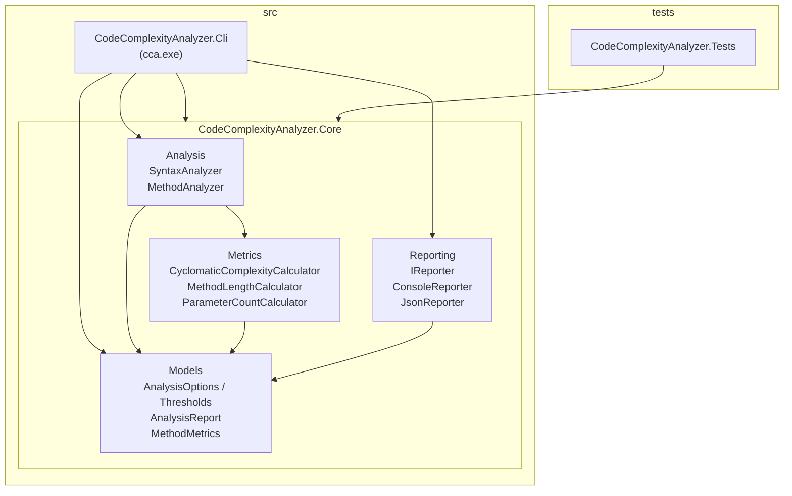
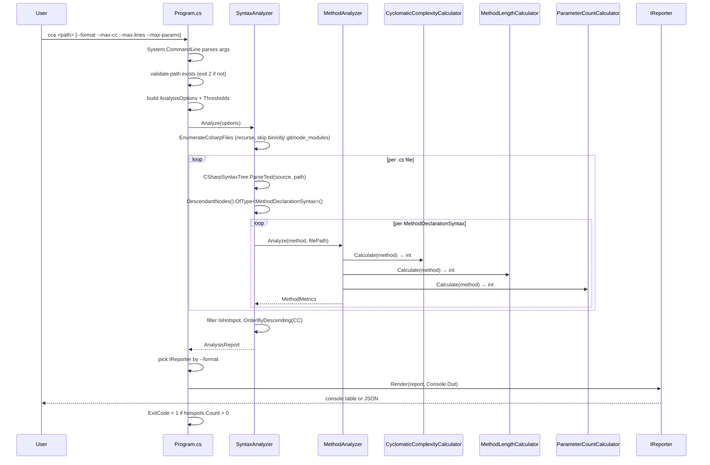

# Codebase Map

> Auto-generated by Cartographer. Last mapped: 2026-05-09T06:53:49Z

## System Overview

**CodeComplexityAnalyzer** (`cca`) is a Roslyn-based static analysis CLI for C#. It parses raw `.cs` files with the syntax-only API (no MSBuild project load, no semantic model), enumerates every `MethodDeclarationSyntax`, computes three metrics per method (cyclomatic complexity, line count, parameter count), filters hotspots that exceed thresholds, and renders the report as either an aligned console table or indented JSON. Exit codes: `0` (clean), `1` (hotspots found), `2` (path not found).

**Stack**: .NET 10 (`net10.0`, SDK `10.0.101`), C# `latest`, Roslyn (`Microsoft.CodeAnalysis.CSharp` 4.14.0), `System.CommandLine` 2.0.0-beta4, xUnit 2.9.3. Nullable reference types, implicit usings, `TreatWarningsAsErrors`, and Central Package Management are enabled solution-wide.



## Directory Structure

```
CodeComplexityAnalyzer/
├── CodeComplexityAnalyzer.sln          VS solution; src/ + tests/ folders
├── Directory.Build.props               net10.0, nullable, warnings-as-errors
├── Directory.Packages.props            Central Package Management (CPM)
├── global.json                         pins SDK 10.0.101
├── README.md                           usage + metrics table + exit codes
├── samples/
│   └── UglyCode.cs                     fixture with deliberate hotspots
├── src/
│   ├── CodeComplexityAnalyzer.Cli/     entry point; AssemblyName=cca
│   │   ├── CodeComplexityAnalyzer.Cli.csproj
│   │   └── Program.cs                  System.CommandLine wiring
│   └── CodeComplexityAnalyzer.Core/    analysis engine (only Roslyn dep)
│       ├── CodeComplexityAnalyzer.Core.csproj
│       ├── Analysis/
│       │   ├── SyntaxAnalyzer.cs       file enumeration + parse + orchestrate
│       │   └── MethodAnalyzer.cs       static; runs all 3 calculators
│       ├── Metrics/
│       │   ├── CyclomaticComplexityCalculator.cs   CSharpSyntaxWalker
│       │   ├── MethodLengthCalculator.cs           line-span based
│       │   └── ParameterCountCalculator.cs         one-liner
│       ├── Models/
│       │   ├── AnalysisOptions.cs      Thresholds + AnalysisOptions records
│       │   ├── AnalysisReport.cs       top-level result record
│       │   └── MethodMetrics.cs        per-method record
│       └── Reporting/
│           ├── IReporter.cs            single Render(...) method
│           ├── ConsoleReporter.cs      fixed-width plain-text table
│           └── JsonReporter.cs         System.Text.Json indented
└── tests/
    └── CodeComplexityAnalyzer.Tests/
        ├── CodeComplexityAnalyzer.Tests.csproj   xUnit, references Core only
        ├── CyclomaticComplexityCalculatorTests.cs   6 unit [Fact]s
        └── SyntaxAnalyzerTests.cs                   3 integration [Fact]s
```

## Module Guide

### CLI (`src/CodeComplexityAnalyzer.Cli`)

**Purpose**: Console entry point. Parses args, builds [AnalysisOptions](src/CodeComplexityAnalyzer.Core/Models/AnalysisOptions.cs), invokes [SyntaxAnalyzer](src/CodeComplexityAnalyzer.Core/Analysis/SyntaxAnalyzer.cs), selects an [IReporter](src/CodeComplexityAnalyzer.Core/Reporting/IReporter.cs), and sets `Environment.ExitCode`.
**Entry point**: [Program.cs](src/CodeComplexityAnalyzer.Cli/Program.cs)

| File | Purpose | Tokens |
|------|---------|--------|
| [CodeComplexityAnalyzer.Cli.csproj](src/CodeComplexityAnalyzer.Cli/CodeComplexityAnalyzer.Cli.csproj) | Exe; `AssemblyName=cca`; refs `System.CommandLine` and Core | 110 |
| [Program.cs](src/CodeComplexityAnalyzer.Cli/Program.cs) | Top-level statements; `RootCommand` with positional `path` and `--format`/`--max-cc`/`--max-lines`/`--max-params` | 489 |

**Exports**: none (Exe).
**Dependencies**: `System.CommandLine`, `CodeComplexityAnalyzer.Core`.
**Dependents**: none.

### Core / Analysis (`src/CodeComplexityAnalyzer.Core/Analysis`)

**Purpose**: Orchestrates the full pipeline: file discovery, Roslyn parsing, per-method metric computation, hotspot filtering.

| File | Purpose | Tokens |
|------|---------|--------|
| [SyntaxAnalyzer.cs](src/CodeComplexityAnalyzer.Core/Analysis/SyntaxAnalyzer.cs) | `sealed class`; public `Analyze(AnalysisOptions) → AnalysisReport`; enumerates files, parses, filters hotspots, sorts by CC desc | 490 |
| [MethodAnalyzer.cs](src/CodeComplexityAnalyzer.Core/Analysis/MethodAnalyzer.cs) | `public static class`; `Analyze(MethodDeclarationSyntax, string filePath) → MethodMetrics`; `FindContainingType` walks parents, falls back to `"<global>"` | 226 |

**Exports**: `SyntaxAnalyzer`, `MethodAnalyzer`.
**Dependencies**: `Microsoft.CodeAnalysis.CSharp`, `Metrics`, `Models`.
**Dependents**: CLI.

### Core / Metrics (`src/CodeComplexityAnalyzer.Core/Metrics`)

**Purpose**: Pure functions. Each calculator is a `public static class` with a single `Calculate(MethodDeclarationSyntax) → int` method.

| File | Purpose | Tokens |
|------|---------|--------|
| [CyclomaticComplexityCalculator.cs](src/CodeComplexityAnalyzer.Core/Metrics/CyclomaticComplexityCalculator.cs) | Uses inner `ComplexityWalker : CSharpSyntaxWalker`; counts `if/while/do/for/foreach/case (incl. pattern)/switch arm/catch/?:/&&/\|\|/??` (base 1) | 462 |
| [MethodLengthCalculator.cs](src/CodeComplexityAnalyzer.Core/Metrics/MethodLengthCalculator.cs) | Inclusive line-span of `method.Body` or `method.ExpressionBody`; `0` for abstract/interface methods | 131 |
| [ParameterCountCalculator.cs](src/CodeComplexityAnalyzer.Core/Metrics/ParameterCountCalculator.cs) | `method.ParameterList.Parameters.Count` | 43 |

**Exports**: three static calculators.
**Dependencies**: `Microsoft.CodeAnalysis.CSharp`.
**Dependents**: `Analysis/MethodAnalyzer`.

### Core / Models (`src/CodeComplexityAnalyzer.Core/Models`)

**Purpose**: Immutable `sealed record` types for inputs and results.

| File | Purpose | Tokens |
|------|---------|--------|
| [AnalysisOptions.cs](src/CodeComplexityAnalyzer.Core/Models/AnalysisOptions.cs) | `Thresholds` (CC=10, Lines=60, Params=5 defaults); `AnalysisOptions` with `RootPath`, `Thresholds`, `IReadOnlyList<string> ExcludeDirectories`; static `ForPath(string)` factory | 113 |
| [AnalysisReport.cs](src/CodeComplexityAnalyzer.Core/Models/AnalysisReport.cs) | `RootPath`, `FilesAnalyzed`, `MethodsAnalyzed`, `Methods` (all), `Hotspots` (violations) | 50 |
| [MethodMetrics.cs](src/CodeComplexityAnalyzer.Core/Models/MethodMetrics.cs) | `MethodName`, `ContainingType`, `FilePath`, `LineNumber` (1-based), `CyclomaticComplexity`, `LineCount`, `ParameterCount` | 51 |

**Exports**: three records.
**Dependencies**: BCL only.
**Dependents**: `Analysis`, `Reporting`, CLI.

### Core / Reporting (`src/CodeComplexityAnalyzer.Core/Reporting`)

**Purpose**: Output abstraction. One interface, two implementations.

| File | Purpose | Tokens |
|------|---------|--------|
| [IReporter.cs](src/CodeComplexityAnalyzer.Core/Reporting/IReporter.cs) | Single method: `void Render(AnalysisReport report, TextWriter writer)` | 35 |
| [ConsoleReporter.cs](src/CodeComplexityAnalyzer.Core/Reporting/ConsoleReporter.cs) | Summary header + fixed-width hotspot table (CC=5, Lines=6, Params=7); plain text (no ANSI) | 229 |
| [JsonReporter.cs](src/CodeComplexityAnalyzer.Core/Reporting/JsonReporter.cs) | `System.Text.Json.JsonSerializer` with `WriteIndented = true`; serializes the entire `AnalysisReport` | 79 |

**Exports**: `IReporter`, `ConsoleReporter`, `JsonReporter`.
**Dependencies**: `Models`, BCL.
**Dependents**: CLI.

### Tests (`tests/CodeComplexityAnalyzer.Tests`)

**Purpose**: xUnit tests. References Core only — CLI is not exercised.

| File | Purpose | Tokens |
|------|---------|--------|
| [CyclomaticComplexityCalculatorTests.cs](tests/CodeComplexityAnalyzer.Tests/CyclomaticComplexityCalculatorTests.cs) | 6 `[Fact]`s; `ParseMethod(source)` helper wraps code in `class C { ... }` | 483 |
| [SyntaxAnalyzerTests.cs](tests/CodeComplexityAnalyzer.Tests/SyntaxAnalyzerTests.cs) | 3 `[Fact]`s using a real GUID-suffixed temp dir, `IDisposable` teardown | 541 |

### Samples

| File | Purpose | Tokens |
|------|---------|--------|
| [samples/UglyCode.cs](samples/UglyCode.cs) | `OrderProcessor` fixture: `Classify` (5 params, deep branching), `Sum` (clean), `DoEverything` (high CC + lines) | 434 |

## Data Flow



## Conventions

- **Namespaces**: file-scoped, mirror folder structure (`CodeComplexityAnalyzer.Core.Analysis`, etc.).
- **Types**: all model types are `sealed record`; service classes are `public static class` (calculators, `MethodAnalyzer`) or `sealed class` (`SyntaxAnalyzer`, reporters). No abstract classes.
- **Calculator pattern**: one folder, one class per metric, one static `Calculate(MethodDeclarationSyntax)` method.
- **Reporter pattern**: implement `IReporter`; the only interface in the codebase.
- **DI**: none. Direct `new`s in [Program.cs](src/CodeComplexityAnalyzer.Cli/Program.cs).
- **Nullable**: enabled solution-wide. No `!` operators in source. `MethodAnalyzer.FindContainingType` returns non-nullable `string` via `"<global>"` fallback.
- **Tests**: xUnit, raw `Assert.Equal`/`Assert.Single` (no FluentAssertions), `[Fact]` only (no `[Theory]` yet). `<Using Include="Xunit" />` in the test `.csproj` makes attributes globally available.
- **Build**: `Directory.Packages.props` is the single source of truth for NuGet versions; `PackageReference` items omit `Version`. `CentralPackageTransitivePinningEnabled` is on.

## Gotchas

The latest commit is `Scaffold v1` — these are the known sharp edges:

1. **Method discovery is incomplete.** Only `MethodDeclarationSyntax` is visited. Constructors, destructors, property/event accessors, indexers, and operators are silently skipped. ([SyntaxAnalyzer.cs](src/CodeComplexityAnalyzer.Core/Analysis/SyntaxAnalyzer.cs))
2. **Local functions and lambdas inflate parent CC.** `ComplexityWalker.Visit(method)` recurses into nested local functions and lambdas — their decision points count toward the enclosing method. There is no `VisitLocalFunctionStatement` override. ([CyclomaticComplexityCalculator.cs](src/CodeComplexityAnalyzer.Core/Metrics/CyclomaticComplexityCalculator.cs))
3. **Switch expression discard arm (`_ =>`) is counted.** It is a `SwitchExpressionArmSyntax` like any other arm. The test `SwitchExpressionArmAddsOnePerArm` asserts CC=4 for 3 arms (1, 2, `_`).
4. **`when` pattern guards are not counted.** `case X when y` adds 0 to CC even though `when` is a branch point.
5. **`??=` (`CoalesceAssignmentExpression`) is not counted.** Only `BinaryExpressionSyntax` is checked; assignment expressions are skipped.
6. **No `--exclude` CLI option.** The exclude list (`bin`, `obj`, `.git`, `node_modules`) is hardcoded in [Program.cs](src/CodeComplexityAnalyzer.Cli/Program.cs).
7. **No `--include` / glob filtering.** Generated files (`.g.cs`, `.Designer.cs`) outside `obj/` are analyzed.
8. **Unknown `--format` value throws an unhandled `ArgumentException`** inside the System.CommandLine handler — it surfaces as a stack trace instead of a clean usage error.
9. **Trailing blank line after JSON.** `Console.Out.WriteLine()` runs unconditionally after `reporter.Render(...)` — strict JSON consumers may complain.
10. **All I/O is synchronous.** No `Task`, `Parallel`, or `CancellationToken`. Large repos will run single-threaded.
11. **No `--max-params` violation by default for `Classify`.** Default `MaxParameters` is 5 and `samples/UglyCode.cs#OrderProcessor.Classify` has exactly 5 — won't flag unless you pass `--max-params 4`.

## Navigation Guide

**To add a new complexity metric (e.g., nesting depth):**
1. New `XxxCalculator.cs` in [src/CodeComplexityAnalyzer.Core/Metrics/](src/CodeComplexityAnalyzer.Core/Metrics/) with `public static int Calculate(MethodDeclarationSyntax)`.
2. Add property to [MethodMetrics.cs](src/CodeComplexityAnalyzer.Core/Models/MethodMetrics.cs).
3. Call the calculator in [MethodAnalyzer.cs](src/CodeComplexityAnalyzer.Core/Analysis/MethodAnalyzer.cs).
4. Add a threshold field to `Thresholds` in [AnalysisOptions.cs](src/CodeComplexityAnalyzer.Core/Models/AnalysisOptions.cs).
5. Update `IsHotspot` in [SyntaxAnalyzer.cs](src/CodeComplexityAnalyzer.Core/Analysis/SyntaxAnalyzer.cs).
6. Add `--max-xxx` option in [Program.cs](src/CodeComplexityAnalyzer.Cli/Program.cs).
7. Add the column to [ConsoleReporter.cs](src/CodeComplexityAnalyzer.Core/Reporting/ConsoleReporter.cs).
8. Add `XxxCalculatorTests.cs` in [tests/CodeComplexityAnalyzer.Tests/](tests/CodeComplexityAnalyzer.Tests/).

**To add a new output format (e.g., HTML, SARIF):**
1. New `XxxReporter.cs` in [src/CodeComplexityAnalyzer.Core/Reporting/](src/CodeComplexityAnalyzer.Core/Reporting/) implementing `IReporter`.
2. Add a branch to the format `switch` in [Program.cs](src/CodeComplexityAnalyzer.Cli/Program.cs) (and consider replacing the `ArgumentException` with a clean error message).

**To change which syntax nodes are considered "methods":**
1. Edit `AnalyzeFile` in [SyntaxAnalyzer.cs](src/CodeComplexityAnalyzer.Core/Analysis/SyntaxAnalyzer.cs) — change `OfType<MethodDeclarationSyntax>()` (e.g., to `BaseMethodDeclarationSyntax` to include constructors).
2. Update [MethodAnalyzer.cs](src/CodeComplexityAnalyzer.Core/Analysis/MethodAnalyzer.cs) signatures to match the new node type.
3. Adjust the metric calculators if their parameter type changes.

**To add an exclude or include CLI option:**
1. Add `Option<string[]>` in [Program.cs](src/CodeComplexityAnalyzer.Cli/Program.cs); pass into `AnalysisOptions.ExcludeDirectories` (or a new `IncludePatterns` field).
2. Add filter logic alongside `IsExcluded` in [SyntaxAnalyzer.cs](src/CodeComplexityAnalyzer.Core/Analysis/SyntaxAnalyzer.cs).

**To add a new test:**
- For pure metric logic: copy the `ParseMethod(string)` helper from [CyclomaticComplexityCalculatorTests.cs](tests/CodeComplexityAnalyzer.Tests/CyclomaticComplexityCalculatorTests.cs).
- For end-to-end behavior: copy the temp-dir + `IDisposable` infrastructure from [SyntaxAnalyzerTests.cs](tests/CodeComplexityAnalyzer.Tests/SyntaxAnalyzerTests.cs).
